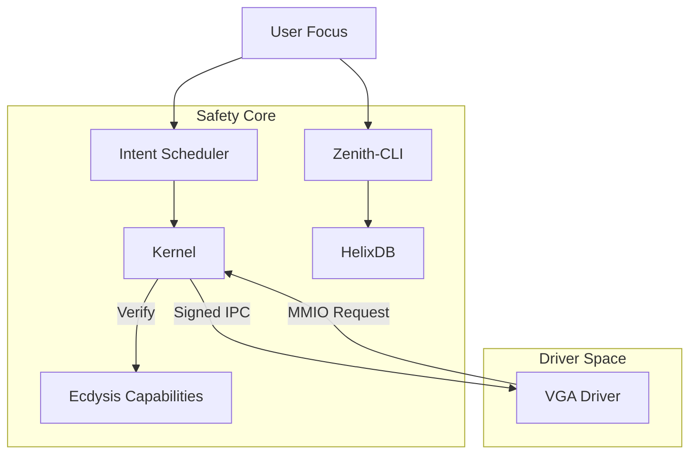

# Zenith OS (2026 Research-Native)

**High-Performance | Memory-Safe | Zero-Trust | AI-Native**

Zenith OS is a next-generation operating system built on a **Framekernel** architecture using **Rust**. It eliminates entire classes of vulnerabilities (buffer overflows, race conditions) and integrates Artificial Intelligence directly into the kernel for Intent-Aware Scheduling.

## 🚀 Key Features

-   **Framekernel Architecture**: Minimal Ring 0 executive. All drivers (VGA, Network, FS) run as **Sandboxed Micro-Services** in Ring 3.
-   **Zero-Trust Security**: No process is trusted by default. Hardware access requires cryptographically verified **Capability Keys** (`Ecdysis`).
-   **AI-Native Scheduling**: **Intent-Aware Scheduler** prioritizes your active "Foreground Mission" (e.g., Coding) and throttles background "Slop" to <5% CPU.
-   **Semantic Shell**: `Zenith-CLI` allows you to find files by *meaning* ("project notes") rather than exact filenames, using **Vector Similarity Search**.
-   **HelixDB Audit**: A local-first vector store that logs and analyzes every IPC event for security anomalies in real-time.

## 🛠️ Technology Stack

-   **Language**: Rust (Edition 2021)
-   **Build System**: Cargo Workspace, Makefile
-   **Security**: SandCell (Isolation), Ecdysis (Capabilities), HelixDB (Audit)
-   **Simulation**: QEMU with `hvf` (Hypervisor.framework) acceleration
-   **Verification**: DeepSURF (Fuzzing), Red Team (Attack Simulation)

## 📦 Getting Started

### Prerequisites
-   Rust (Nightly/Stable 2026)
-   QEMU
-   Make

### Build & Run Simulation
To compile the Kernel, Drivers, and boot the OS in QEMU:

```bash
make run-qemu
```

### Run Security Verification
To launch the **Red Team** Agent and attempt a buffer overflow exploit (which Zenith OS will block):

```bash
make test-security
```

### Run AI Benchmarks
To verify the Scheduler's latency impact (Target < 10ms):

```bash
cargo run -p bench_latency
```

### Try the Semantic Shell
To interact with the vector-search CLI:

```bash
cargo run -p zenith_cli
```

## 🏗️ Architecture




*Zenith OS is a research project exploring the future of safe, agentic operating systems.*
